<h1 style="text-align:center;font-size:56px;">
华鹰平板App船员手册
</h1>


<p align="center">

</p>


<h3 style="text-align:center;font-weight:normal;">
2026-06-25
</h3>

<div style="page-break-after: always;"></div>


<div style="display:flex;align-items:center;">
    <h1>安全声明</h1>
    
</div>


## 请在使用前仔细阅读

本手册适用于智能船舶控制平板应用程序（以下简称“本系统”）。在使用本系统前，请仔细阅读并理解本手册中的全部内容，以确保安全、正确地使用各项功能。


## 重要安全提示

本系统为船舶辅助控制与监测系统，可用于船舶状态监控、航线规划、自动循迹、电子围栏管理等功能，但不能替代船员的专业判断和现场操作。

在使用过程中，请遵守以下安全要求：

### 保持人工监控

无论船舶处于手动驾驶还是自动循迹状态，船员均应保持对周围环境、航道情况及船舶状态的持续监控。

### 自动功能不等于无人驾驶

自动循迹功能仅根据预设航线控制船舶航行，不具备完全自主避碰能力。船员应随时做好接管准备，并根据实际情况进行人工干预。


### 紧急情况下立即接管

当出现以下情况时，应立即停止自动控制并切换至人工驾驶：

- 船舶偏离预定航线
- 周边出现障碍物或其他船舶
- 恶劣天气影响航行安全
- GNSS定位异常
- 通讯链路异常
- 控制设备报警

### 注意定位精度限制

本系统依赖GNSS卫星定位数据。受天气、环境遮挡、电磁干扰等因素影响，定位精度可能出现波动。

在以下环境中应谨慎使用自动控制功能：

- 桥梁下方
- 港区密集建筑区域
- 山体遮挡区域
- 恶劣天气环境

### 注意设备状态

航行前应确认：

- 平板设备电量充足
- 控制器工作正常
- GNSS状态正常
- 网络连接正常
- 推进系统工作正常

### 数据仅供参考

本系统显示的船位、速度、航向、航迹等信息来源于船载设备和传感器数据，仅供辅助决策参考。船员应结合现场实际情况进行判断。

## 免责声明

因设备故障、通讯异常、卫星信号中断、第三方地图数据误差、不可抗力因素或不当操作导致的航行风险和损失，系统开发方不承担由此产生的直接或间接责任。

用户应遵守当地法律法规及相关航行规定，并对船舶运行安全承担最终责任。

<div style="page-break-after: always;"></div>

# 二、系统简介

软件版本：1.0.0

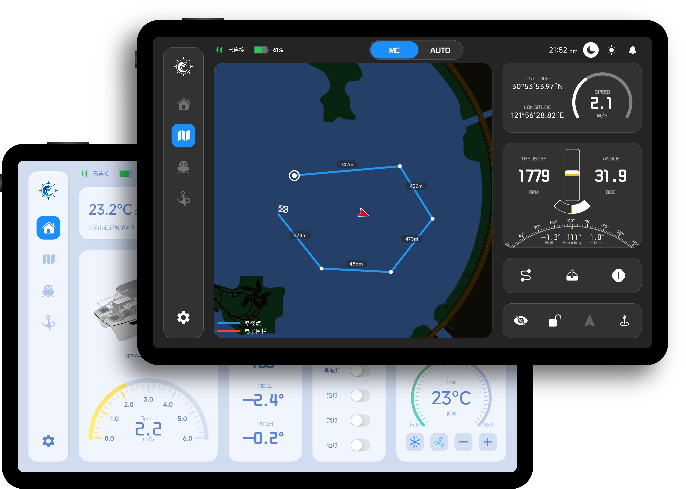

## 系统概述

该系统是一套集航线规划、自动循迹、电子围栏和设备管理于一体的智能化船舶辅助控制平台。

船员可通过平板应用实时查看船舶运行状态，并完成航行任务管理和自动控制操作，提高航行效率和作业安全性。

## 主要功能

### 实时监控

实时显示：

- 船舶位置
- 船舶轨迹
- 航向信息
- 航行速度
- 推进器状态
- 电源状态
- 通讯状态

### 航线管理

支持：

- 创建航线
- 编辑航线
- 保存航线
- 删除航线

### 自动循迹

根据预设航线自动控制船舶航行。

### 电子围栏

支持创建和管理电子围栏区域，实现：

- 离开区域提醒
- 越界报警

### 历史记录

支持查看：

- 消息历史
- 报警记录

### 报警管理

当设备或船舶状态异常时，系统能够及时发出报警提示，帮助船员快速发现并处理问题。


<div style="page-break-after: always;"></div>

# 三、App整体结构概述

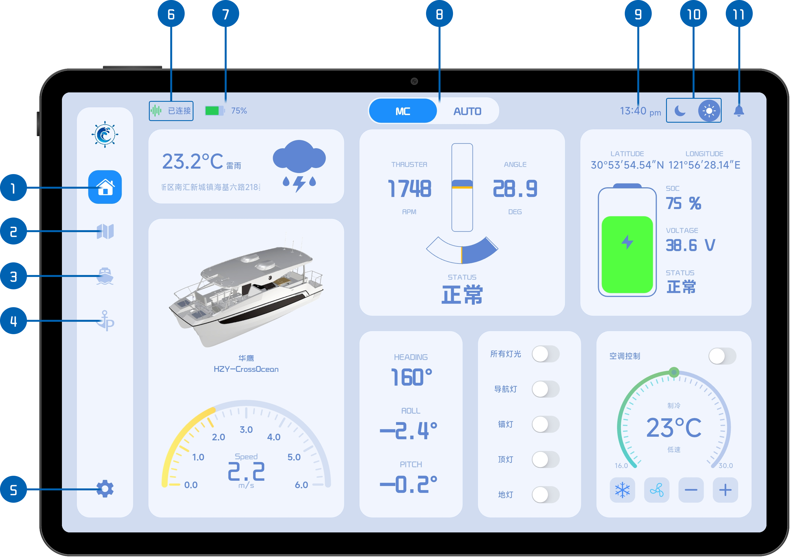


1. [主页面](./HomePage/homePage.md)
2. [地图页面](./MapPage/mapPage.md)
3. [智能设备控制页面](./ShipPage/shipPage.md)
4. [靠泊页面](./BerthPage/berthPage.md)
5. [设置页面](./SettingPage/settingPage.md)
6. 船舶连接状态
7. 船舶电池电量
8. 手动、自动模式切换
9. 当前时间显示
10. [明暗主题切换](./SettingPage/feature/themeSetting.md)
11. 消息记录、告警记录显示按钮


该App整体通过点击左侧导航栏的按钮切换不同的页面，顶部有一个常驻状态栏，状态栏显示了船舶连接状态、船舶剩余电量，手动/自动模式切换按钮，当前时间显示，明暗主题切换按钮，以及消息、告警记录按钮。

## 1、船舶连接状态：

显示平板应用与船舶控制器之间的通讯状态：

| 状态   | 说明                     |
| ------ | ------------------------ |
| 已连接 | 平板与船舶控制器通讯正常 |
| 断开   | 当前无法与船舶建立通讯   |


## 2、船舶电池电量：

显示船舶动力电池当前剩余电量，当电量低于30%时会显示红色：


建议在航行前确认电池电量满足任务需求。

## 3、手动、自动模式切换

### 手动模式（MC）

船舶由驾驶员直接控制。

适用于：

- 日常驾驶
- 复杂航道
- 紧急接管

### 自动模式（AUTO）

船舶根据任务规划自动执行航行操作。

适用于：

- 自动循迹
- 自动巡航
- 预设任务执行

> 注意：自动模式下船员仍需持续关注周围环境，并随时准备接管船舶控制权。

## 4、明暗主题切换

用于[切换系统显示主题](./SettingPage/feature/themeSetting.md)。

### 日间模式

适用于白天和光照充足环境。

特点：

- 界面亮度较高
- 内容显示清晰

### 夜间模式

适用于夜间航行环境。

特点：

- 降低屏幕眩光
- 减少夜间视觉干扰
- 提升夜间观察舒适性

船员可根据环境条件随时切换显示主题。

## 5、消息、告警记录按钮

点击该按钮时，会在右侧显示一个悬浮窗，包含了app打开到现在产生的消息记录。

主要包括：

### 系统消息

记录系统运行信息，例如：

- 登录记录
- 参数修改记录
- 任务执行记录
- 系统状态变化记录

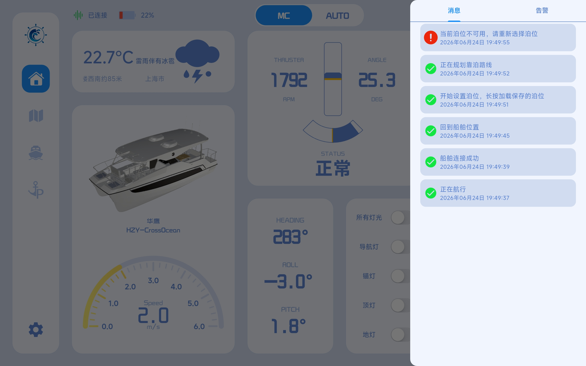

<div style="page-break-after: always;"></div>

# 四、航行状态显示

## 一、航速仪表盘

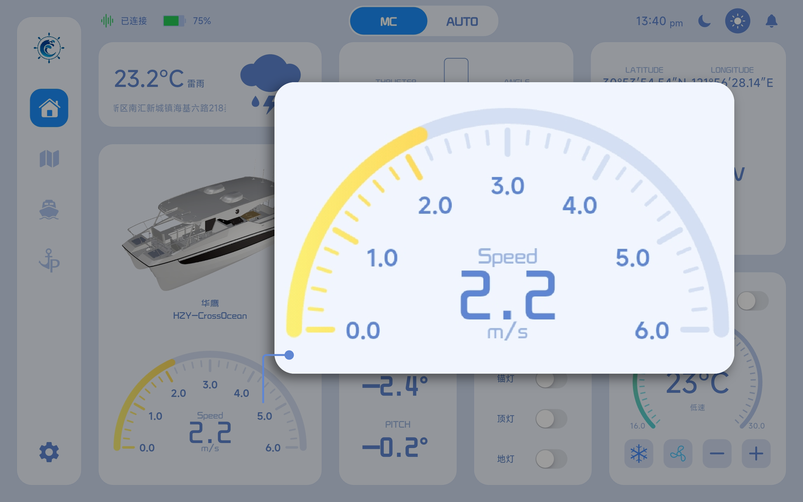


航速仪表盘位于主页左下区域，用于实时显示当前船舶航行速度，帮助船员快速掌握船舶运行状态。

#### 功能说明

仪表盘以指针表盘形式显示船舶当前航速，数据来源于船载定位系统（GNSS）和船舶控制系统。

显示内容包括：

- 当前航速数值
- 航速单位（m/s）
- 仪表盘量程范围
- 当前速度对应的刻度位置

系统会根据实时数据自动刷新显示内容。

#### 航速单位

航速采用国际单位制：

```
m/s（米每秒）
```


## 二、推进器信息


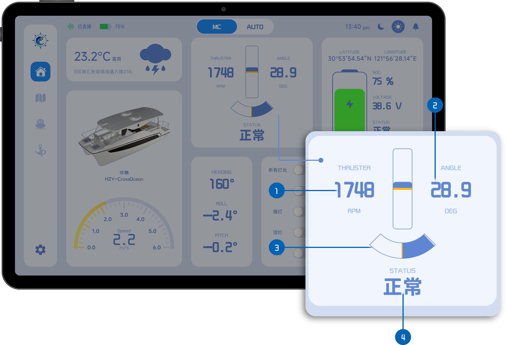

推进器信息卡片位于主页中部区域，用于实时显示船舶推进器的运行状态，包括推进器转速、转向角度、推力方向及工作状态等信息。

通过该区域，船员可快速了解当前推进系统运行情况和船舶动力输出状态。


#### 1. 推进器转速（Thruster RPM）

显示当前推进器实际转速。

单位：

```
RPM（Revolutions Per Minute，转/分钟）
```

转速数值反映推进器当前输出功率。

一般情况下：

- 转速越高，推进器输出推力越大
- 转速越低，推进器输出推力越小
- 转速为 0 RPM 时，推进器处于停止状态

船员可通过转速变化判断船舶当前动力输出情况。

#### 2. 推进器角度数值（Angle）

显示推进器当前转向角度。

单位：

```
DEG（Degree，度）
```

角度数值表示推进器相对于船体中心线的偏转方向。

例如：

| 角度 | 说明           |
| ---- | -------------- |
| 0°   | 推进器朝向船首 |
| 30°  | 向右偏转30°    |
| -30° | 向左偏转30°    |
| 90°  | 侧向推进       |

推进器角度直接影响船舶航向控制和横向移动能力。

#### 3. 推力与角度指示器

用于直观显示推进器当前推力方向和转向状态。

该区域由以下部分组成：

##### 推力输出指示

垂直刻度条用于显示当前推进器推力输出比例。

特点：

- 推力越大，指示位置越高
- 推力越小，指示位置越低
- 实时反映当前动力输出状态

##### 角度指示器

扇形指示区域用于显示推进器当前转向方向。

特点：

- 中间位置表示推进器处于正前方
- 指示区域向左偏移表示左转
- 指示区域向右偏移表示右转
- 偏转幅度与实际推进器角度同步变化

船员可通过该图形快速判断推进器当前朝向，而无需关注具体角度数值。

#### 4. 推进器状态（Status）

显示推进系统当前工作状态。

常见状态包括：

| 状态名称           | 说明                                                       | 建议处理措施                                           |
| ------------------ | ---------------------------------------------------------- | ------------------------------------------------------ |
| 正常               | 推进器运行正常，各项参数处于允许范围内。                   | 无需处理。                                             |
| 堵转               | 推进器受到异物缠绕、卡阻或负载过大，导致电机无法正常转动。 | 检查螺旋桨及推进器周围是否存在障碍物，排除后重新启动。 |
| 电机过温           | 推进电机温度超过安全工作范围。                             | 降低负载或停止运行，待温度恢复正常后再继续使用。       |
| 驱动器过温         | 电机驱动模块（MOS）温度过高。                              | 检查散热系统是否正常工作，必要时暂停运行。             |
| 过流               | 推进器工作电流超过允许范围。                               | 检查推进器负载、螺旋桨状态及供电系统。                 |
| 通信故障           | 无法与推进器控制器正常通信。                               | 检查控制器供电、通信线路及网络连接状态。               |
| 电机温度传感器异常 | 无法正确获取电机温度信息。                                 | 检查温度传感器及相关线路连接。                         |
| 驱动器温度报警     | 驱动器温度接近保护阈值。                                   | 建议降低推进器输出功率，并检查散热情况。               |
| 过压               | 输入电压超过设备允许范围。                                 | 检查电池组、电源模块及充电设备。                       |
| 欠压               | 输入电压低于设备正常工作范围。                             | 检查电池剩余电量并及时充电。                           |
| 电路故障           | 检测到驱动器内部或外部电路异常。                           | 停止使用设备，并联系维护人员进行检查                   |
| 散热风扇故障       | 驱动器散热风扇工作异常。                                   | 检查风扇供电、连接线路及风扇本体。                     |

#### 状态显示规则

#### 使用说明

- 推进器转速、角度和状态均为实时刷新数据。
- 自动航行模式下，推进器角度和转速由控制系统自动调整。
- 手动模式下，推进器响应驾驶员操作指令。

#### 注意事项

- 推进器状态显示“故障”时，应立即停止相关操作并检查设备。
- 推进器信息仅作为监控参考，实际控制效果受船体载荷、水流、风力等环境因素影响。


## 三、船体姿势角度


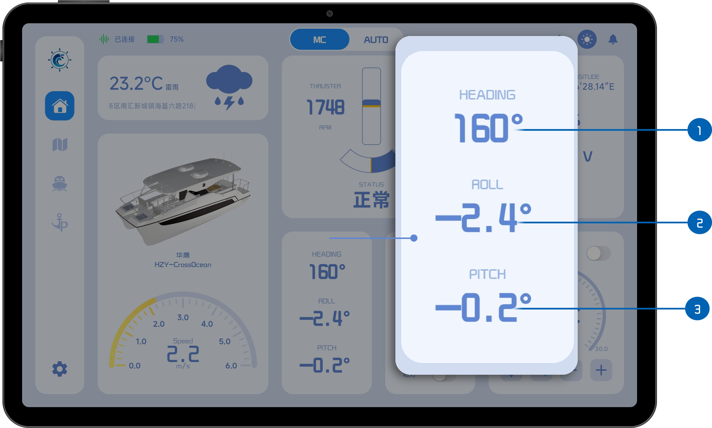


船舶姿态信息位于主页中部区域，用于实时显示船舶当前航向及姿态状态，包括航向角（Heading）、横滚角（Roll）和俯仰角（Pitch）。

通过姿态信息，船员可及时掌握船舶运动状态和船体姿态变化情况，为航行控制和作业安全提供参考。

#### 1. 航向角（Heading）

航向角表示船首当前指向方向。

单位：

```
°（Degree，度）
```

#### 2. 横滚角（Roll）

横滚角表示船体绕纵向轴（船首至船尾方向）的倾斜角度。

单位：

```
°（Degree，度）
```

横滚角反映船体左右倾斜情况。


#### 3. 俯仰角（Pitch）

俯仰角表示船体绕横向轴（左舷至右舷方向）的倾斜角度。

单位：

```
°（Degree，度）
```

俯仰角反映船首和船尾的上下姿态变化。


## 四、电池信息

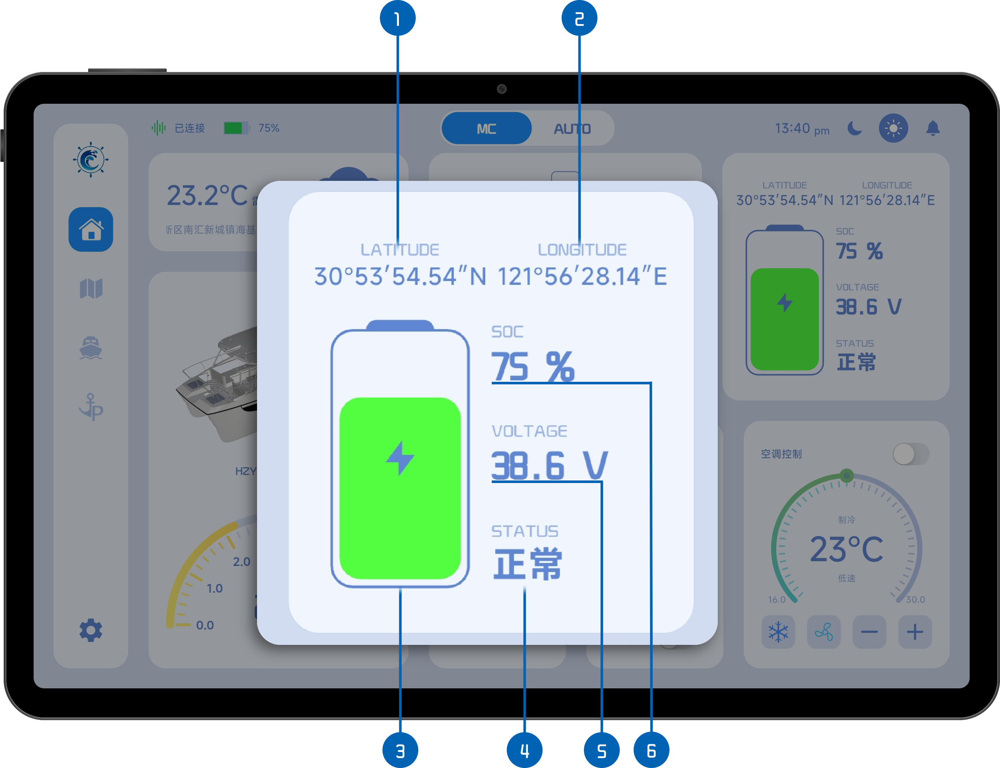

电池信息卡片位于主页右上区域，用于实时显示船舶当前位置、电池状态以及供电信息，帮助船员及时掌握船舶能源状况和剩余续航能力。

#### 1. 船体位置纬度（Latitude）

显示船舶当前位置纬度信息。

#### 2. 船体位置经度（Longitude）

显示船舶当前位置经度信息。

#### 3. 电池电量图标

用于图形化显示当前电池剩余电量。

电量图标会根据剩余电量自动变化，帮助船员快速判断电池状态。

#### 4. 电池状态（Status）

显示电池系统当前运行状态。

#### 5. 电池当前电压（Voltage）

显示电池组实时输出电压。

单位：

```
V（伏特）
```

#### 6. 电池当前剩余容量（SOC）

SOC（State of Charge）表示电池剩余可用容量百分比。

单位：

```
%（百分比）
```


<div style="page-break-after: always;"></div>

# 五、灯光-空调控制


## 一、灯关控制

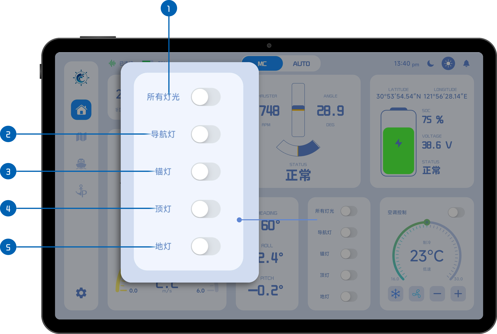

#### 1. 所有灯光控制开关

用于统一控制船舶全部灯光设备。

开启后：

- 导航灯
- 锚灯
- 顶灯
- 地灯

将根据当前配置统一开启。

关闭后：

- 所有受控灯光将统一关闭。

该功能适用于快速开启或关闭整船照明系统。


#### 2. 导航灯控制开关

用于控制船舶导航灯。

#### 3. 锚灯控制开关

用于控制船舶锚灯。

#### 4. 顶灯控制开关

用于控制船体顶部照明灯。


#### 5. 地灯控制开关

用于控制船体地灯或甲板辅助照明灯。


#### 开关状态说明

灯光控制采用滑动开关方式进行操作。

| 开关状态 | 说明           |
| -------- | -------------- |
| 开启     | 对应灯光已打开 |
| 关闭     | 对应灯光已关闭 |

点击或滑动开关即可切换灯光状态。


#### 状态同步机制

灯光控制页面显示的是船体灯光的实际工作状态。

当出现以下情况时，界面状态将自动同步更新：

- 用户在当前页面操作灯光开关
- 用户在智能设备控制页面操作灯光
- 船载控制系统直接控制灯光
- 灯光设备状态发生变化

因此，界面显示状态始终与船体实际灯光状态保持一致。


#### 智能设备控制页面

除主页快捷控制外，系统还在《[智能设备控制页](../../ShipPage/shipPage.md)》中提供完整的灯光管理功能。

智能设备控制页面可显示：

- 每个灯光设备的名称
- 灯光实时状态
- 灯光安装位置
- 灯光控制功能

便于船员快速识别和管理船体各位置灯光设备。

#### 注意事项

- 夜间航行时应按照当地航行规则正确使用导航灯。
- 锚泊期间应根据实际情况开启锚灯。
- 长时间开启高功率照明设备可能增加电池能耗。
- 若开关状态与实际灯光状态不一致，请检查灯光设备和通信状态是否正常。


## 二、空调控制

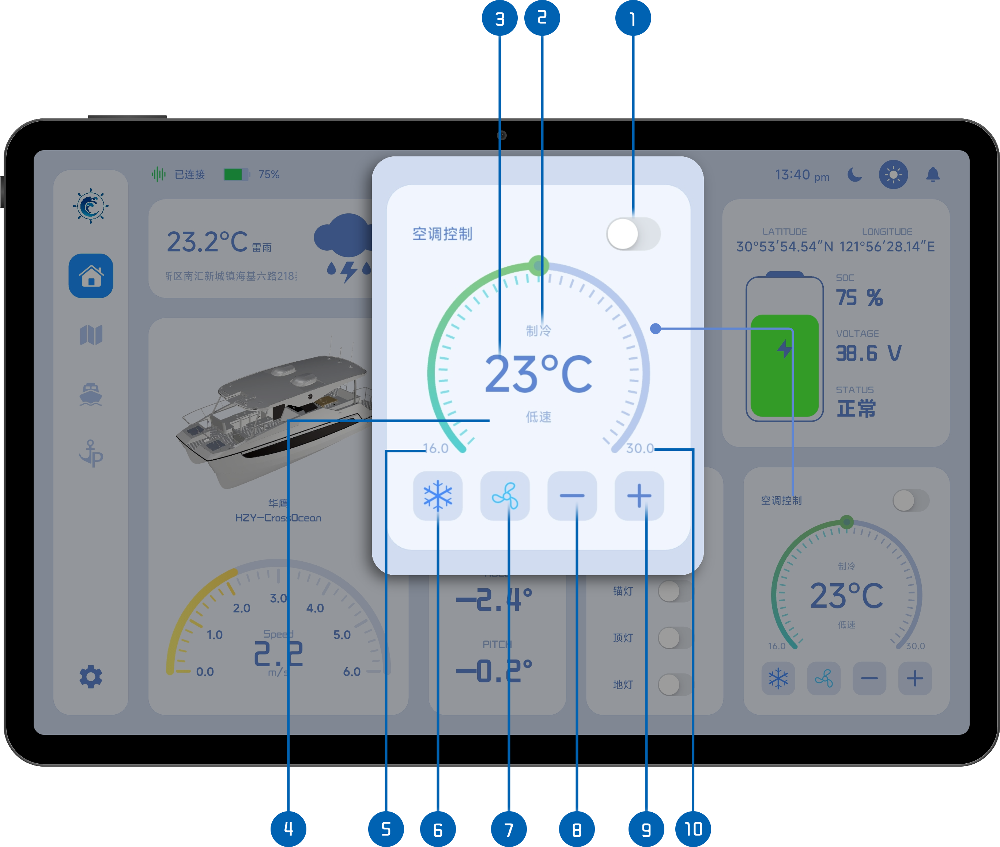

空调控制区域位于主页右下区域，用于显示和控制船舱空调设备运行状态。

船员可通过该区域快速查看当前空调工作模式、设定温度及风速等级，并进行快捷调节，无需进入智能设备控制页面即可完成常用操作。


#### 1. 空调开关

用于控制空调设备的启动和关闭。

状态说明：

| 状态 | 说明           |
| ---- | -------------- |
| 开启 | 空调正在运行   |
| 关闭 | 空调已停止运行 |

开启后，空调将按照当前设定的模式、温度和风速运行。

#### 2. 空调模式

显示当前空调运行模式。

支持以下模式：

| 模式 | 说明         |
| ---- | ------------ |
| 制冷 | 降低舱内温度 |
| 制热 | 提高舱内温度 |
| 除湿 | 降低空气湿度 |

#### 3. 空调温度

显示当前设定温度。

#### 4. 空调风速

显示当前风速等级。

支持以下档位：

| 风速 | 说明                     |
| ---- | ------------------------ |
| 低速 | 风量较小，运行噪声较低   |
| 中速 | 适用于日常使用           |
| 高速 | 快速调节舱内温度         |
| 自动 | 根据环境温度自动调整风速 |

#### 5. 最低支持温度

显示空调允许设置的最低温度。

#### 6. 空调模式切换按钮

用于切换空调运行模式。

点击后可循环切换：

```
制冷 → 制热 → 除湿 → 制冷
```

#### 7. 空调风速切换按钮

用于切换风速等级。

点击后可循环切换：

```
低速 → 中速 → 高速 → 自动
```

#### 8. 降低温度按钮（－）

用于降低空调设定温度。

每点击一次：

```
温度降低 1℃
```

#### 9. 升高温度按钮（＋）

用于提高空调设定温度。

每点击一次：

```
温度升高 1℃
```

#### 10. 最高支持温度

显示空调允许设置的最高温度。


#### 注意事项

- 空调关闭状态下无法调整温度和风速。
- 制冷模式下温度设置过低会增加电池能耗。
- 长时间使用高速风速可能增加设备功耗。
- 自动模式下风速由空调设备自动控制。
- 若空调状态长时间未更新，请检查设备连接状态是否正常。

<div style="page-break-after: always;"></div>

# 六、天气数据

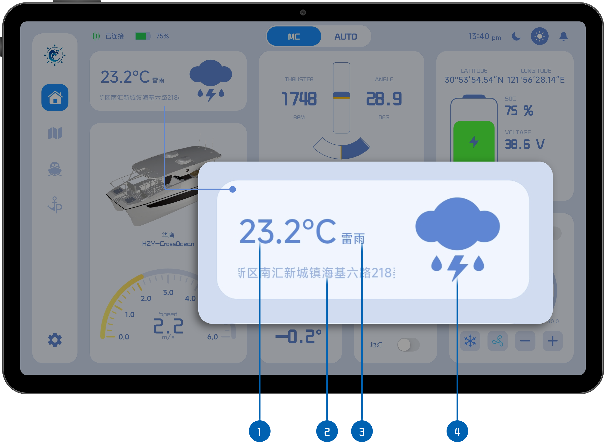


1. 当前温度
2. 当前地址
3. 天气情况
4. 天气情况图标

天气信息卡片位于主页左上区域，用于显示船舶当前位置的实时天气状况，为船员提供航行和作业环境参考。

#### 显示内容

天气信息区域包含以下内容：

##### 1、当前温度

显示当前位置实时气温。

单位：

```
℃
（摄氏度）
```

例如：

```
23.2℃
```

该温度数据来源于天气服务平台，仅供参考。

##### 2、当前地址

显示船舶当前位置对应的地理位置信息。

##### 3、天气情况

显示当前天气状态。

##### 4、天气图标

使用图形化方式显示当前天气状态。


#### 重新加载天气数据

天气信息依赖网络连接获取。

在以下情况下可能导致天气数据加载失败：

- 网络连接异常
- 移动网络信号较弱
- 卫星网络通信延迟
- 天气服务暂时不可用

当天气数据获取失败时，界面会显示加载失败提示。

此时可点击：

```
重新加载
```

按钮重新请求天气数据。

系统将重新获取当前位置对应的天气信息。


<div style="page-break-after: always;"></div>

<div style="display:flex;align-items:center;">
    <h1>循迹</h1>
    
</div>


循迹功能用于使船舶按照预设航线自动航行。

使用该功能前，需要先配置一条航线，并设置目标航行速度。启动后，系统将控制船舶沿预设路径持续航行。

航线支持以下两种方式创建：

- 自定义绘制：在地图上手动绘制航线
- 历史加载：从已保存的航线记录中选择并加载 
- 


## 1、选择循迹类型

- 点击右下角的“循迹”按钮，进入航线模式选择弹窗


- 选择对应的航线模式后，点击“确定”，进入航线编辑状态


## 2、在地图上绘制循迹路线

### 路线绘制工具说明

在该模式下，点击地图即可添加路径点，系统会按添加顺序自动连接各点，从而生成完整航线。


1. **循迹类型：**点击可重新选择循迹模式（弹出模式选择窗口）
2. **循迹速度：**通过滑块设定目标航行速度
3. **撤销操作：**撤销上一步编辑操作
4. **重做操作：**恢复已撤销的操作
5. **清空路径点：**删除当前所有路径点
6. **保存路线：**将当前航线保存至本地或服务器
7. **速度微调：**逐步增加航行速度
8. **速度微调：**逐步降低航行速度
9. **总行程：**自动计算当前航线总长度
10. **路径点详情：**展示当前选中点信息，支持单点删除
11. **路径点：**构成航线的基础节点
12. **路径中心点：**点击或拖动可在中间插入新的路径点
13. **路径长度：**显示相邻节点间距离
14. **发送轨迹：**提交当前航线并进入发送确认流程
15. **退出编辑：**退出航线绘制模式


## 3、发送循迹路线

航线绘制完成后，点击“发送轨迹”按钮，将弹出确认窗口。

用户需再次确认以下信息：

- 循迹类型
- 预设航行速度
- 总行程距离

确认无误后，点击“发送”即可下发航线任务，船舶将按照预设路线开始自动航行。


<div style="page-break-after: always;"></div>

# 八、电子围栏

电子围栏用于限制船舶的安全航行范围，确保船舶始终在可控区域内运行。

通过在地图上绘制封闭区域，可创建一个电子围栏。当船舶驶出该区域时，系统将触发声光报警，提示用户已超出安全范围。

电子围栏数据会在本地持久保存，即使关闭 App 也不会被清除，下次启动时将自动加载上一次设置的围栏。


## 1、进入电子围栏编辑模式

点击右下角“电子围栏”按钮，进入围栏绘制界面

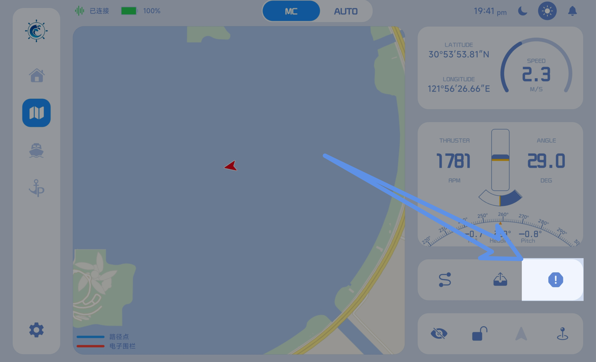


## 2、绘制电子围栏

电子围栏以**闭合的半透明多边形**形式展示，其绘制方式与路径点编辑类似。

用户可在地图上点击添加围栏节点，系统将按顺序连接各节点并自动闭合区域。

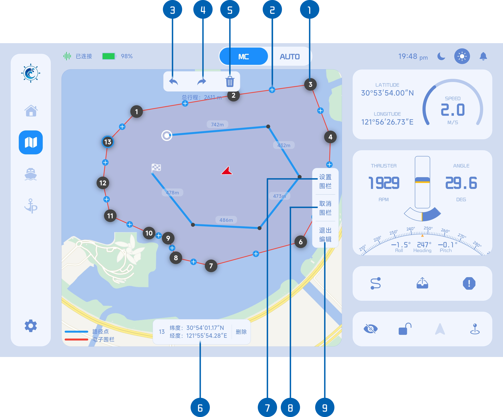

1. 围栏节点：构成电子围栏边界的基础点
2. 边线中点：点击或拖动可在中点位置插入新节点
3. 撤销操作：撤销上一步编辑
4. 重做操作：恢复已撤销操作
5. 清空围栏：删除当前所有围栏节点
6. 节点详情：显示当前选中节点信息，可删除单个节点
7. 设置围栏：提交当前围栏并进入确认流程
8. 取消围栏：取消当前已设置的电子围栏
9. 退出编辑：退出编辑模式并隐藏绘制工具


## 3、设置电子围栏

当电子围栏绘制完成后，点击“设置围栏”按钮，将弹出确认窗口。

用户需确认当前围栏范围无误后，点击“确认”按钮即可完成设置。

设置成功后，系统将启用电子围栏保护机制。

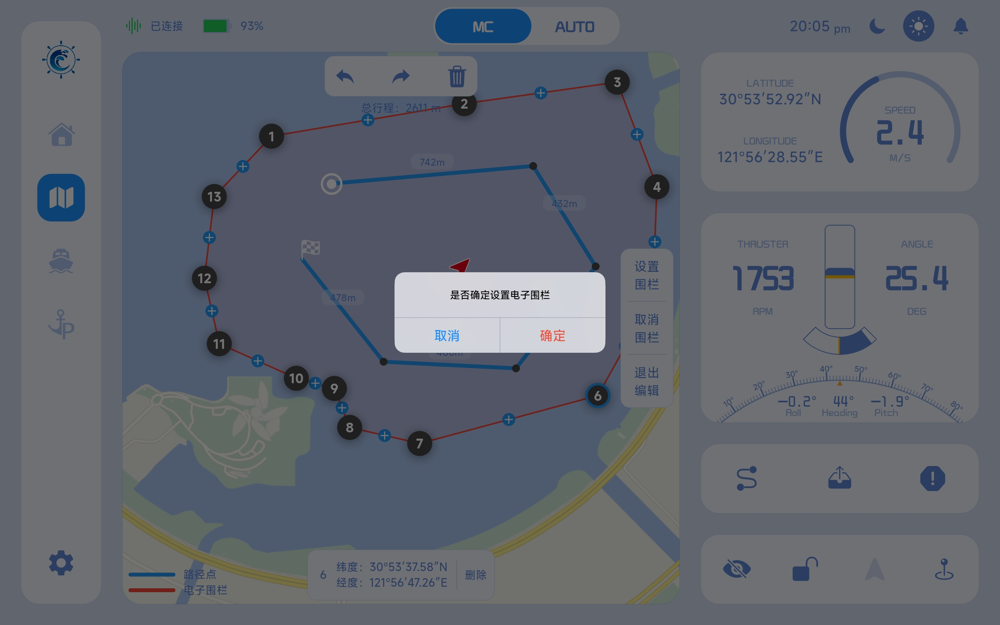


## 4、围栏报警机制

当船舶运行过程中超出电子围栏范围时，系统将自动触发报警。平板设备会通过**声光提示**提醒船员及时关注船舶状态并采取相应措施。

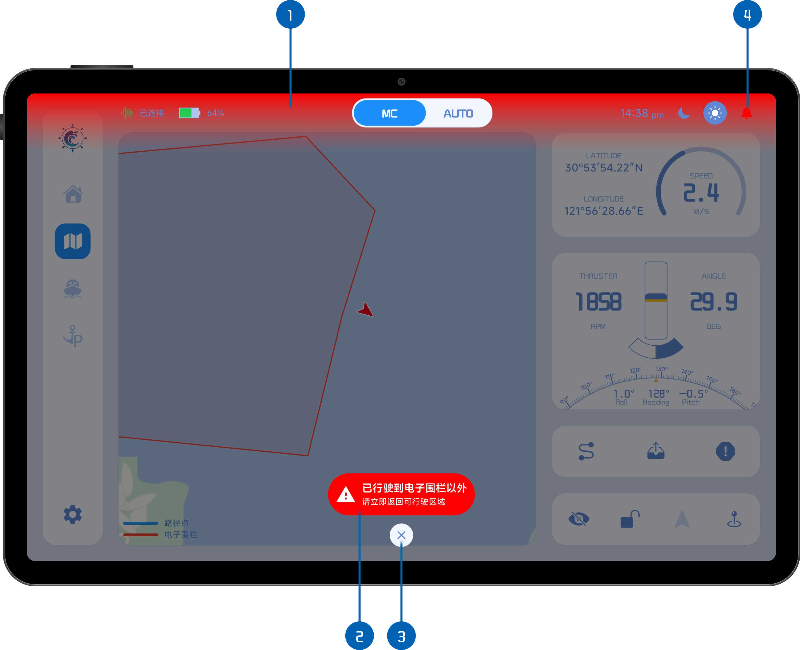

1. **警告动画：** 当船舶超出电子围栏范围时，屏幕将显示红色遮罩并持续闪烁，以提示当前存在告警事件。
2. **告警信息：** 显示当前告警的具体原因，帮助船员快速了解异常情况。
3. **关闭告警按钮：** 点击该按钮后，屏幕上的红色遮罩和闪烁动画将被关闭，但不会解除实际告警状态。
4. **告警按钮：** 当系统检测到告警事件时，告警按钮将变为红色并持续闪烁。即使关闭了告警动画，告警按钮仍会保持闪烁状态，用户无法手动关闭。只有当系统检测到告警条件解除后，告警按钮才会自动恢复正常显示。

**关闭告警动画后告警按钮保持闪烁：**

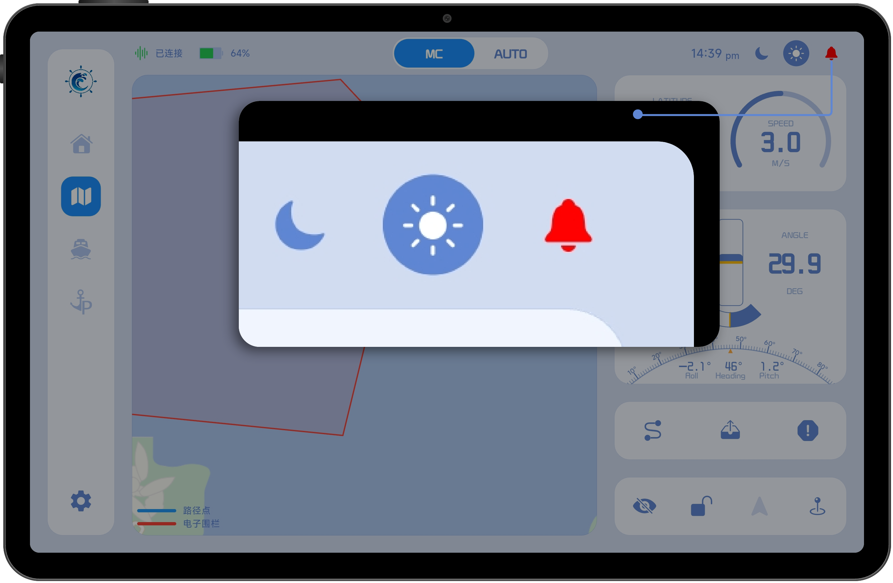


<div style="page-break-after: always;"></div>

# 九、地图控制

App 提供了完善的地图控制能力，支持地图移动、缩放、船舶定位等操作，以满足不同使用场景下的操控需求。

同时，为提升操作安全性并减少误触，系统提供“地图锁定”功能。开启后，地图将无法拖动，且视图中心始终跟随船舶当前位置。

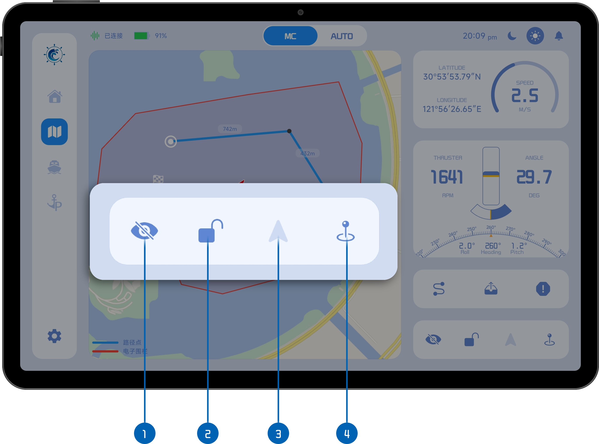

1. 船舶实时轨迹开关：控制是否显示船舶的实时运动轨迹，长按该按钮可清除历史实时轨迹数据。
2. 地图锁定开关：开启后地图无法拖动，视角将锁定并持续跟随船舶当前位置。
3. 船舶方向固定开关：开启后船舶图标方向保持正前方不变，地图将根据船舶航向角进行旋转，实现“航向朝上”的视角模式。
4. 定位船舶按钮：点击后地图视角将自动移动至船舶当前位置，实现快速回中定位。


<div style="page-break-after: always;"></div>

# 十、航线保存

App 提供航线保存功能，可将已绘制的航线（包含速度配置）保存至本地。

保存后的航线可在下次使用时直接加载，无需重新绘制，适用于高频使用的复杂航线场景，可显著提升操作效率。


## 1、保存航线

当航线绘制完成后，点击绘制工具栏右侧的“保存”按钮即可进入保存流程。

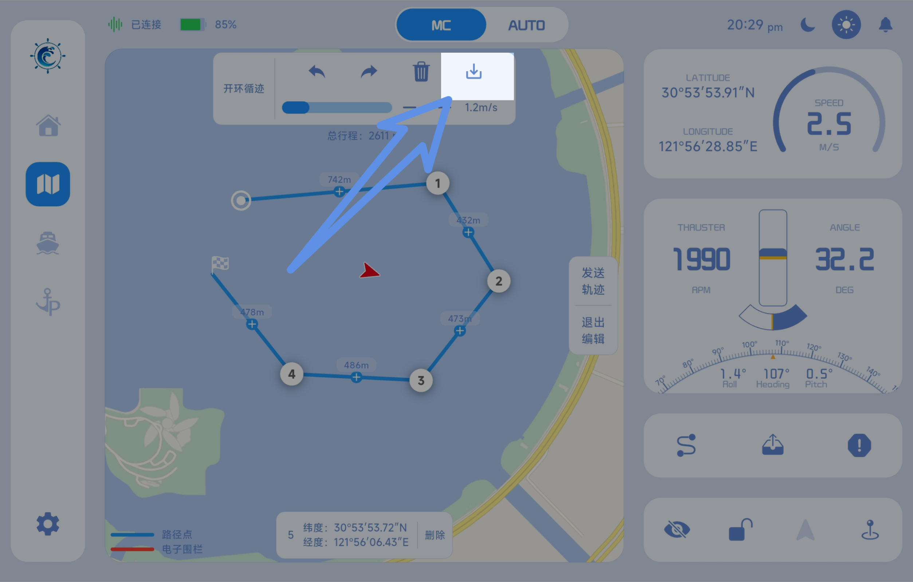

点击后将弹出保存确认窗口，用户需要为航线设置名称。系统会提供默认名称（通常为当前时间），但建议用户自定义具有识别性的名称，以便后续快速查找与管理。

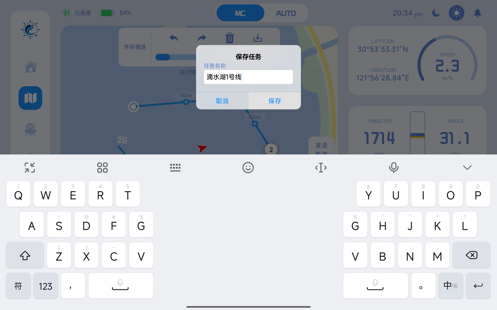

确认信息无误后，点击“保存”按钮，即可将航线存储至本地。

## 2、航线加载

已保存的航线可通过本地列表快速加载。点击右下角“加载”按钮，即可打开航线列表。

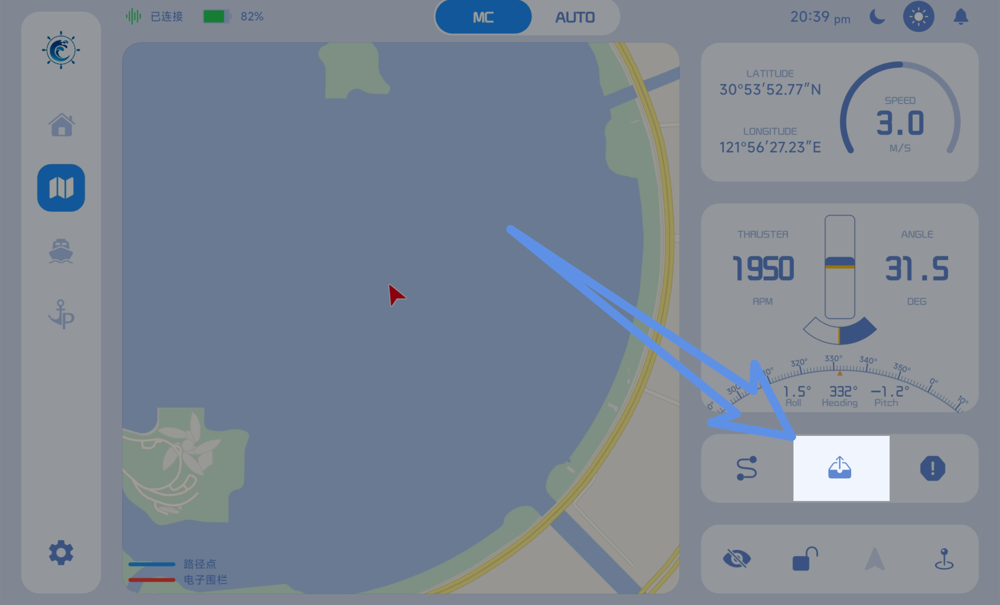

在“本地任务”列表中，可以查看所有已保存的航线，例如“滴水湖1号线”。

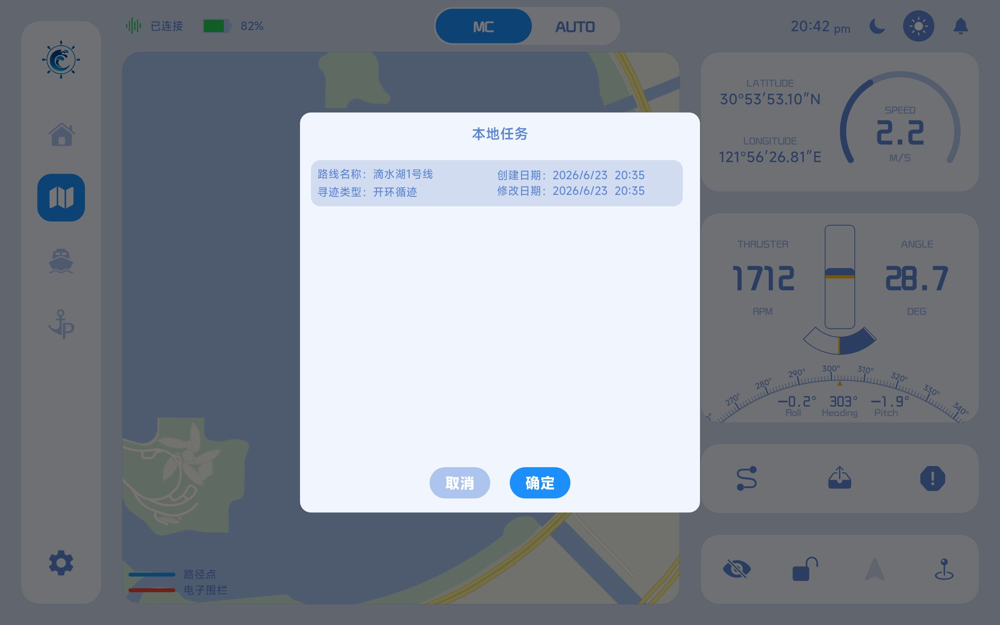

选择目标航线后点击“确认”，系统将自动加载该航线并显示在地图中。

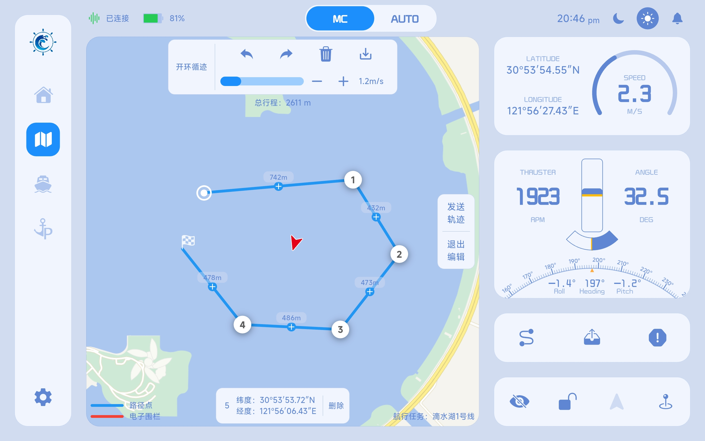


## 3、说明

- 航线保存内容包含：路径点信息 + 预设速度
- 保存数据为本地持久化存储，不会因关闭 App 而丢失
- 加载航线后可直接进入编辑或发送流程


<div style="page-break-after: always;"></div>

# 十一、智能设备控制页面

该页面用于对船载智能设备进行集中控制，主要包括灯光与空调系统的控制功能。用户可在此页面实时查看设备状态，并进行调整。


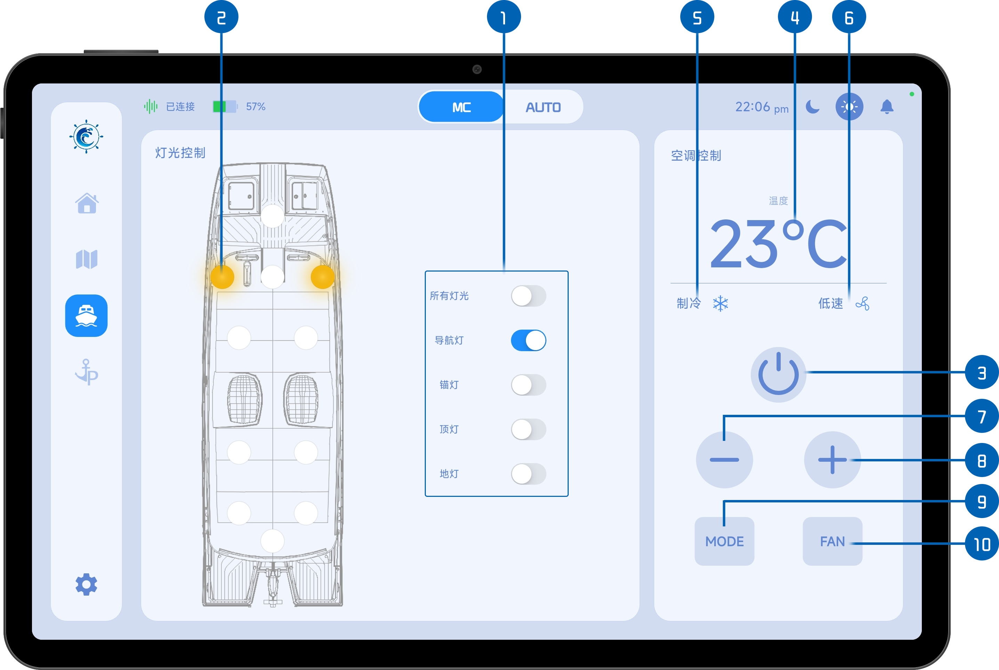

1. **灯光控制开关：**用于开启或关闭船舶灯光系统
2. **灯光状态指示：**显示当前灯光状态
   - 开启状态：橙色显示
   - 关闭状态：白色显示
3. **空调开关：**用于开启或关闭空调系统
4. **空调当前设定温度：**显示当前空调目标温度
5. **空调当前模式：**显示当前运行模式（如制冷 / 制热 / 除湿等）
6. **空调当前风速：**显示当前风速档位
7. **空调温度调低按钮：**每次点击降低设定温度
8. **空调温度调高按钮：**每次点击提高设定温度
9. **空调模式切换按钮：**用于切换空调运行模式
10. **空调风速调节按钮：**用于调整空调风速档位

<div style="page-break-after: always;"></div>

# 十二、靠泊

## 1、靠泊页面

靠泊页面用于辅助船舶进行泊位对准与靠泊操作，提供实时航行状态与推进器控制信息。

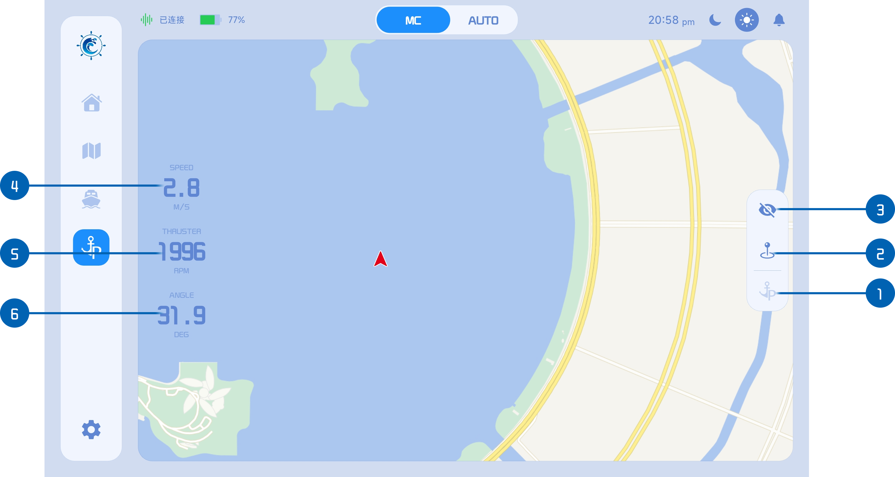

1. **选择泊位按钮：** 进入泊位选择与编辑模式，用于设定目标泊位区域
2. **回到船舶当前位置按钮：**将地图视角快速定位至船舶当前位置
3. **实时轨迹显示开关：**控制是否显示船舶实时运行轨迹
4. **当前速度显示：**显示船舶当前航行速度
5. **推进器转速：**显示当前推进器的转速状态
6. **推进器角度：**显示推进器当前角度信息


## 2、靠泊点编辑

首先点击“选择泊位按钮”

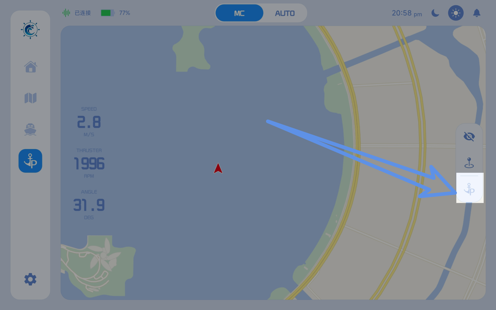


系统将自动执行以下操作：

- 地图中心自动回到船舶当前位置
- 地图缩放至适合泊位选择的视图等级
- 显示可编辑泊位矩形区域

泊位以**可拖动、可旋转的矩形区域**形式呈现，用于精确设定靠泊位置。

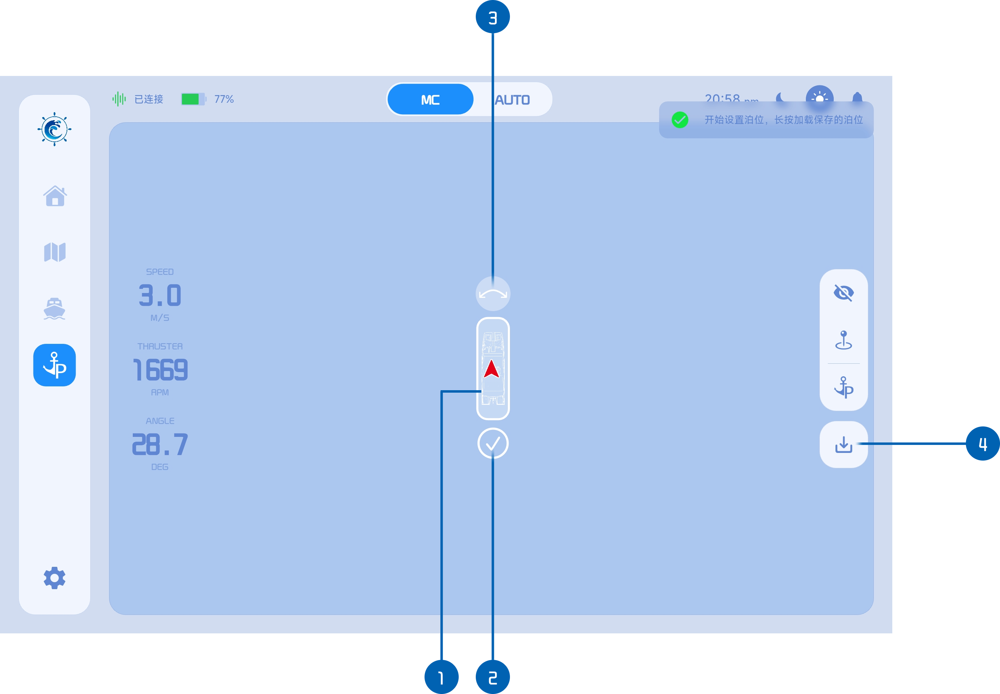

1. **泊位区域矩形：**用于表示当前选定的泊位范围，可进行位置调整
2. **确定泊位按钮：**确认当前泊位设置并进入保存流程
3. **泊位旋转控制：**用于调整泊位朝向角度，使其与实际码头方向一致
4. **泊位保存按钮：**保存当前泊位配置，供后续快速调用

<div style="page-break-after: always;"></div>

# 十三、泊位保存

## 1、保存泊位

泊位保存功能用于将已编辑的泊位区域保存至本地，便于后续快速调用与重复使用。在泊位编辑模式下，右侧工具栏提供“保存泊位”按钮。

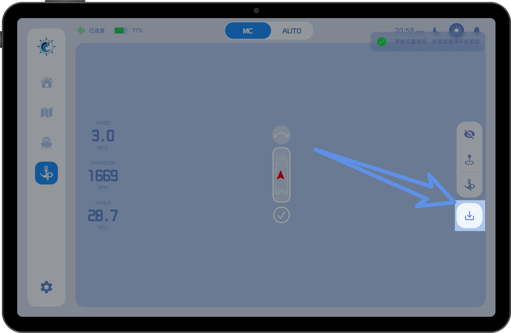

点击该按钮后，将弹出“保存泊位”确认窗口，用户需输入泊位名称。确认信息无误后，点击“确定”即可完成保存，泊位将存储至本地。

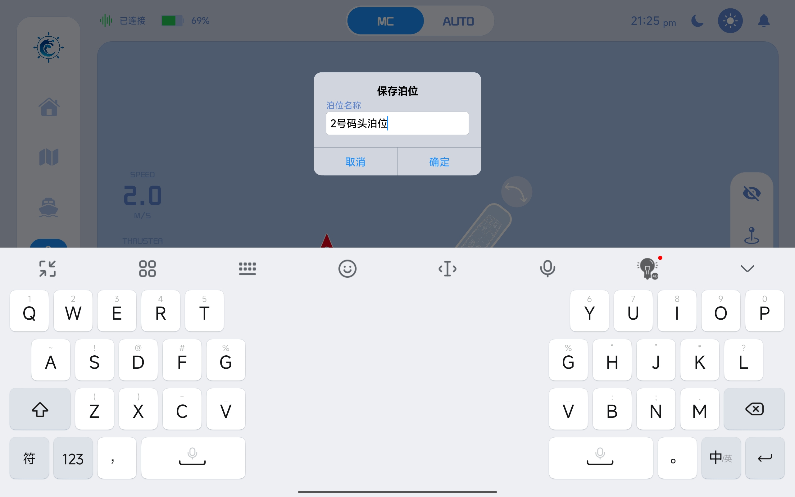

## 2、加载已保存泊位

已保存的泊位可通过“我的泊位”列表进行加载。在靠泊页面中，长按“靠泊”按钮，即可打开“我的泊位”弹窗。

在弹窗中选择目标泊位后，点击“确定”，系统将自动将该泊位加载至地图中并生效

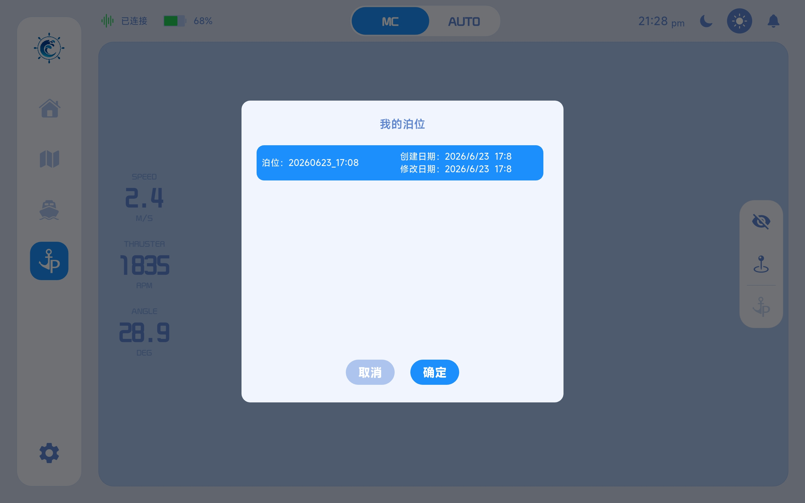


<div style="page-break-after: always;"></div>

# 十四、船舶设置

船舶设置页面用于配置船舶运行相关的核心参数，包括航速限制、船体尺寸、电池参数以及推进器性能等，以确保系统显示与控制逻辑与实际船舶状态一致。


1. **最大 / 最小航速设置**

   用于设置船舶允许的最大与最小航行速度。

   - 最大航速用于仪表盘速度范围显示
   - 同时用于速度滑块上限限制，避免误操作导致过高速度输入，提升航行安全性

2. **船体尺寸设置**
    用于配置船体实际尺寸参数。
    在靠泊页面中，泊位选择框会根据船体尺寸进行地图比例映射，从而提高泊位选择的精确度与实际贴合度。

3. **电池设置**
    用于配置电池参数与电量显示方式，包括：

   - 电池最大电压
   - 电池最小电压
   - 电量显示模式

   当电量显示模式设置为“电池电压”时，系统将根据当前电压值计算并显示剩余电量。

4. **推进器设置**

   用于配置推进系统的性能参数，包括：

   - 最大转速限制
   - 最大角度范围

## 说明

- 所有参数用于统一系统显示与真实设备状态
- 参数设置将直接影响仪表盘显示与控制逻辑
- 建议根据实际船舶硬件参数进行配置，避免偏差


<div style="page-break-after: always;"></div>

# 十五、主题切换

为适配不同光照环境（如强光与弱光场景），提升界面可视性与使用舒适度，App 提供主题切换功能。

用户可通过点击切换按钮，在不同主题模式之间快速切换，以获得更合适的视觉体验。


## 深色模式效果：

深色模式适用于弱光或夜间环境，可有效降低屏幕亮度刺激，提升长时间使用的舒适性。在深色模式下，地图与界面整体采用深色风格显示，以增强对比度并突出关键操作元素。

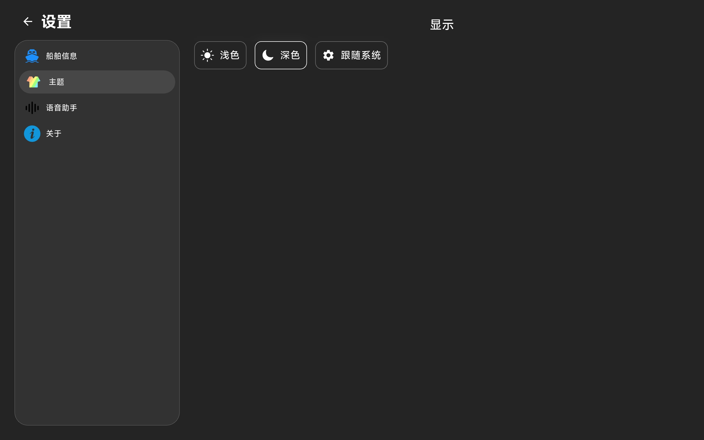

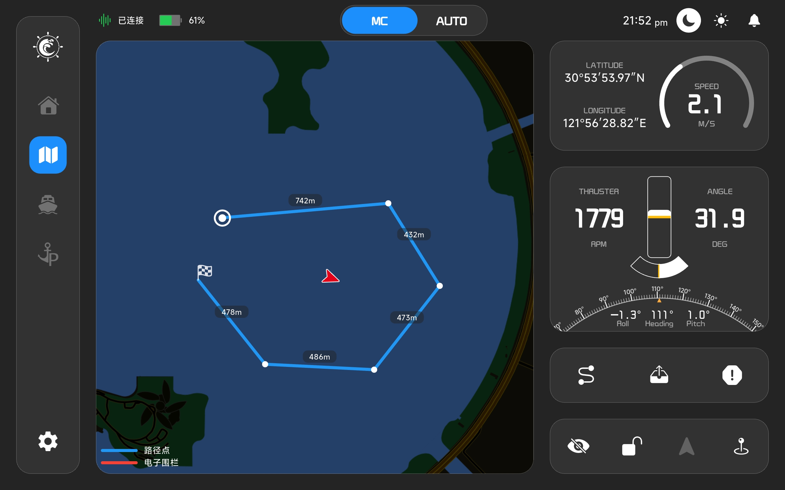


<div style="page-break-after: always;"></div>

# 十六、语音助手设置

App 提供语音助手功能开关，用于通过语音方式控制船舶智能设备，提升操作便捷性与交互效率。

## 1、语音助手开关

用户可在设置页面开启或关闭语音助手功能。


## 2、权限授权

首次开启语音助手时，系统需要申请麦克风权限。

用户需授权麦克风访问权限，以便语音助手（“小韵”）能够接收语音指令。


## 3、语音唤醒与控制

完成授权后，用户可通过语音唤醒语音助手。

在平板端说出：

> “你好小韵”

即可唤醒语音助手“小韵”，并通过语音指令控制船舶相关智能设备。

用户可在[语音助手](../../XiaoYun/xiaoYun.md)说明页面查看更多功能详情。


## 4、说明

- 语音功能依赖麦克风权限，请确保已正确授权
- 语音唤醒词为“你好小韵”
- 语音助手可用于控制灯光、空调等船载设备
- 功能可在设置中随时开启或关闭


<div style="page-break-after: always;"></div>

# 十七、小韵语音助手

小韵语音助手是一种面向船舶智能设备的语音交互功能，用户无需手动操作平板，即可通过语音指令完成设备控制，实现更高效、便捷的操作体验。

在设置页面[打开语音助手](../SettingPage/feature/languageAssistant.md)功能后，用户可通过唤醒词：

> “你好小韵”

唤醒语音助手并开始语音控制。


## 1、核心能力

小韵语音助手支持对船舶智能设备的多维度控制，主要包括以下能力：

- 灯光系统控制（整体或单设备开关）
- 空调系统控制（开关、模式、温度、风速等）
- 航行辅助功能控制（如自动驾驶模式开关）

通过自然语言指令，用户可以实现对设备的快速操作，无需进入具体控制页面。

## 2、支持的语音指令范围

小韵语音助手支持多种自然语言表达方式，系统会自动识别用户意图并映射到对应控制行为。

### 1. 灯光控制

支持对全船灯光或单个灯具进行开关控制，例如顶灯、导航灯、地灯、锚灯等均可独立控制。

同时支持“全部灯光开/关”等批量控制指令。

------

### 2. 空调控制

支持空调系统的完整控制能力，包括：

- 开关控制
- 温度调节（精确到具体温度或模糊表达，如升高/降低一点）
- 模式切换（制冷 / 制热 / 除湿 / 通风 / 自动等）
- 风速调节（高、中、低、自动档位）
- 扫风控制

同时支持自然语言表达，例如“温度高一点”“风速调低”等模糊指令。

------

### 3. 自动驾驶控制

支持对船舶自动驾驶模式的开启与关闭控制，并兼容多种表达方式（如“开启自动驾驶”“打开自动模式”等）。


## 3、说明

- 使用语音功能前需确保已开启语音助手并授予麦克风权限
- 唤醒词为“你好小韵”
- 语音指令会实时映射到对应设备控制逻辑
- 建议在环境噪音较低时使用以获得更高识别准确率

<div style="page-break-after: always;"></div>

# 十八、相关术语

**循迹：**指船舶按照预设航线自动航行的功能。

**航线：**由多个路径点按顺序连接形成的航行路径，可用于循迹任务。

**路径点：**航线中的基础节点，用于定义船舶航行路径的关键位置。

**电子围栏：**在地图上定义的安全区域边界，用于限制船舶航行范围。

**越界报警：**当船舶驶出电子围栏区域时触发的声光提示机制。

**靠泊：**指船舶靠近并对准泊位区域的操作过程。

**泊位：**用于船舶停靠的目标区域，在系统中以矩形区域表示。


<div style="page-break-after: always;"></div>

