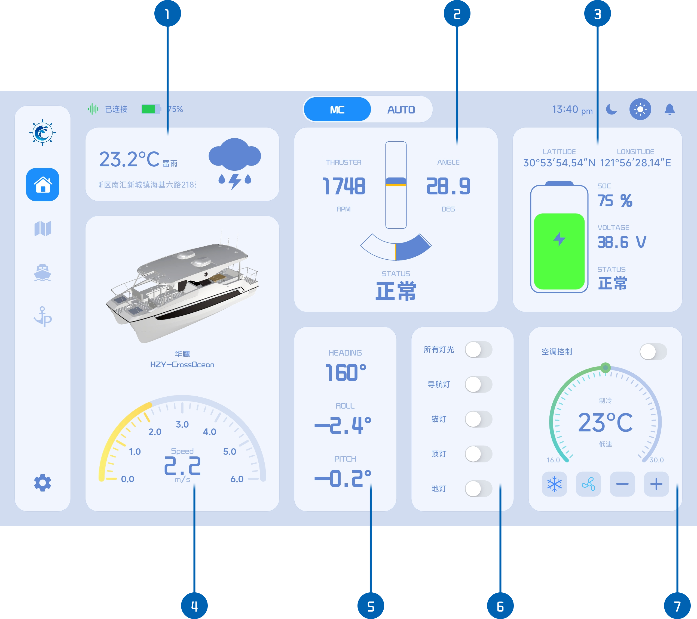

# 主页面

1. 当前天气信息（[天气数据](./feature/weatherInfo.md)）
2. 推进器推力和角度信息（[航行状态显示](./feature/sailingState.md)）
3. 船舶位置经纬度和电池信息（[航行状态显示](./feature/sailingState.md)）
4. 船体样式和速度信息（[航行状态显示](./feature/sailingState.md)）
5. 船体姿势角度信息（[航行状态显示](./feature/sailingState.md)）
6. 灯光控制面板（[灯光-空调控制](./feature/lightsAirControl.md)）
7. 空调控制面板（[灯光-空调控制](./feature/lightsAirControl.md)）