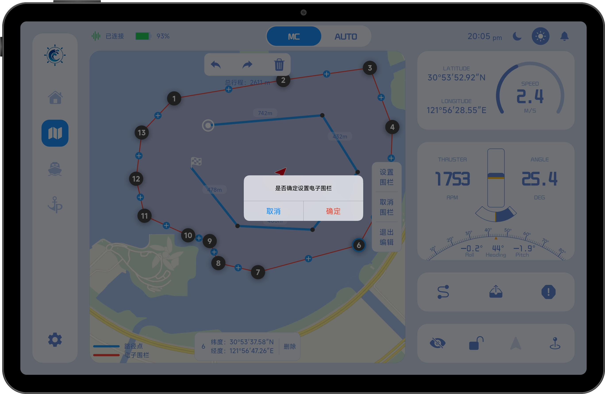

# 电子围栏

电子围栏用于限制船舶的安全航行范围，确保船舶始终在可控区域内运行。

通过在地图上绘制封闭区域，可创建一个电子围栏。当船舶驶出该区域时，系统将触发声光报警，提示用户已超出安全范围。

电子围栏数据会在本地持久保存，即使关闭 App 也不会被清除，下次启动时将自动加载上一次设置的围栏。

## 1、进入电子围栏编辑模式

点击右下角“电子围栏”按钮，进入围栏绘制界面

## 2、绘制电子围栏

电子围栏以**闭合的半透明多边形**形式展示，其绘制方式与路径点编辑类似。

用户可在地图上点击添加围栏节点，系统将按顺序连接各节点并自动闭合区域。

1. **围栏节点**：构成电子围栏边界的基础点
2. **边线中点**：点击或拖动可在中点位置插入新节点
3. **撤销操作：** 撤销上一步编辑
4. **重做操作：** 恢复已撤销操作
5. **清空围栏：** 删除当前所有围栏节点
6. **节点详情：**显示当前选中节点信息，点击右侧删除按钮可删除当前点
7. **设置围栏：**提交当前围栏并进入确认流程
8. **取消围栏：**取消当前已设置的电子围栏
9. **退出编辑：**退出编辑模式并隐藏绘制工具

## 3、设置电子围栏

当电子围栏绘制完成后，点击“设置围栏”按钮，将弹出确认窗口。

用户需确认当前围栏范围无误后，点击“确认”按钮即可完成设置。

设置成功后，系统将启用电子围栏保护机制。

## 4、围栏报警机制

当船舶运行过程中超出电子围栏范围时，系统将自动触发报警。平板设备会通过**声光提示**提醒船员及时关注船舶状态并采取相应措施。

1. **警告动画：** 当船舶超出电子围栏范围时，屏幕将显示红色遮罩并持续闪烁，以提示当前存在告警事件。
2. **告警信息：** 显示当前告警的具体原因，帮助船员快速了解异常情况。
3. **关闭告警按钮：** 点击该按钮后，屏幕上的红色遮罩和闪烁动画将被关闭，但不会解除实际告警状态。
4. **告警按钮：** 当系统检测到告警事件时，告警按钮将变为红色并持续闪烁。即使关闭了告警动画，告警按钮仍会保持闪烁状态，用户无法手动关闭。只有当系统检测到告警条件解除后，告警按钮才会自动恢复正常显示。

**关闭告警动画后告警按钮保持闪烁：**

