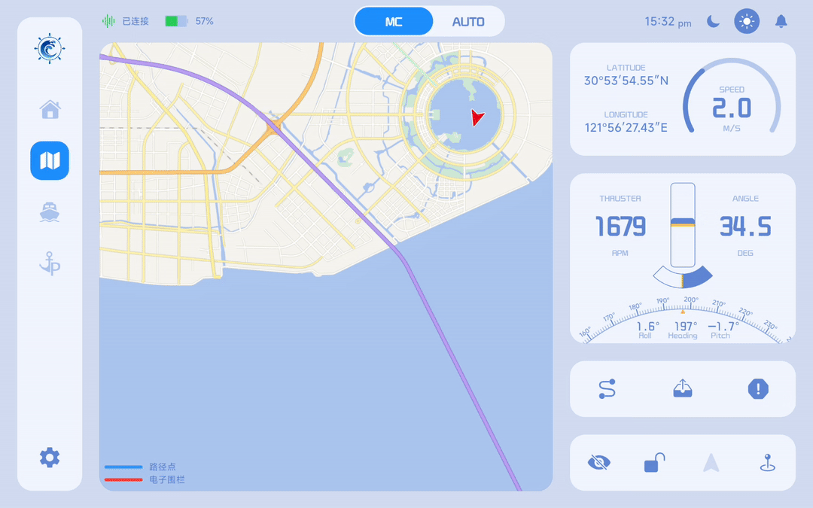

# 地图控制

App 提供了完善的地图控制能力，支持地图移动、缩放、船舶定位等操作，以满足不同使用场景下的操控需求。

同时，为提升操作安全性并减少误触，系统提供“地图锁定”功能。开启后，地图将无法拖动，且视图中心始终跟随船舶当前位置。

1. **船舶实时轨迹显示开关：** 控制是否显示船舶的实时运动轨迹，长按该按钮可清除历史实时轨迹数据。
2. **地图锁定开关：** 开启后地图中心立刻移动到船舶当前位置，且地图无法拖动（可以进行双指缩放地图操作），视角将锁定并持续跟随船舶当前位置。

3. **船舶方向固定开关：** 开启后船舶图标方向保持正前方不变，地图将根据船舶航向角进行旋转，实现“航向朝上”的视角模式。

4. **定位船舶按钮：** 点击后地图视角将自动放大并移动至船舶当前位置，实现快速回中定位。

