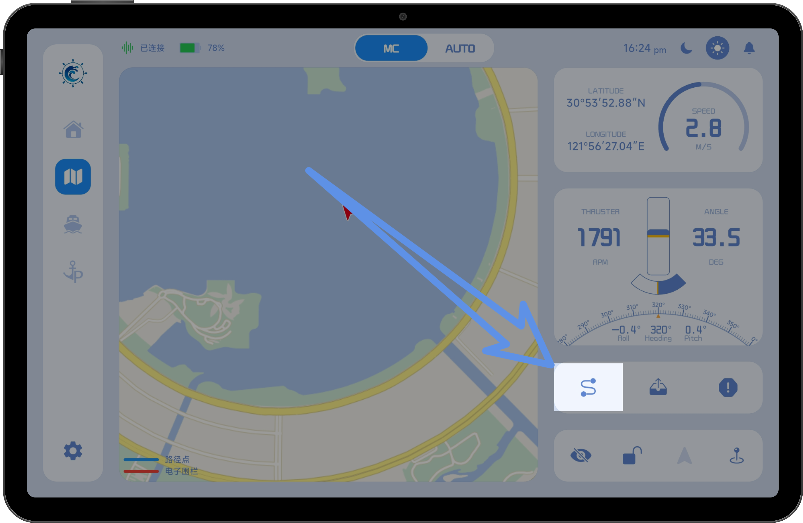
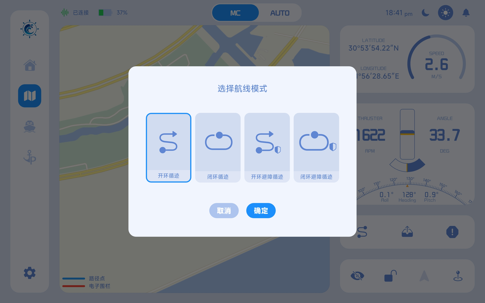
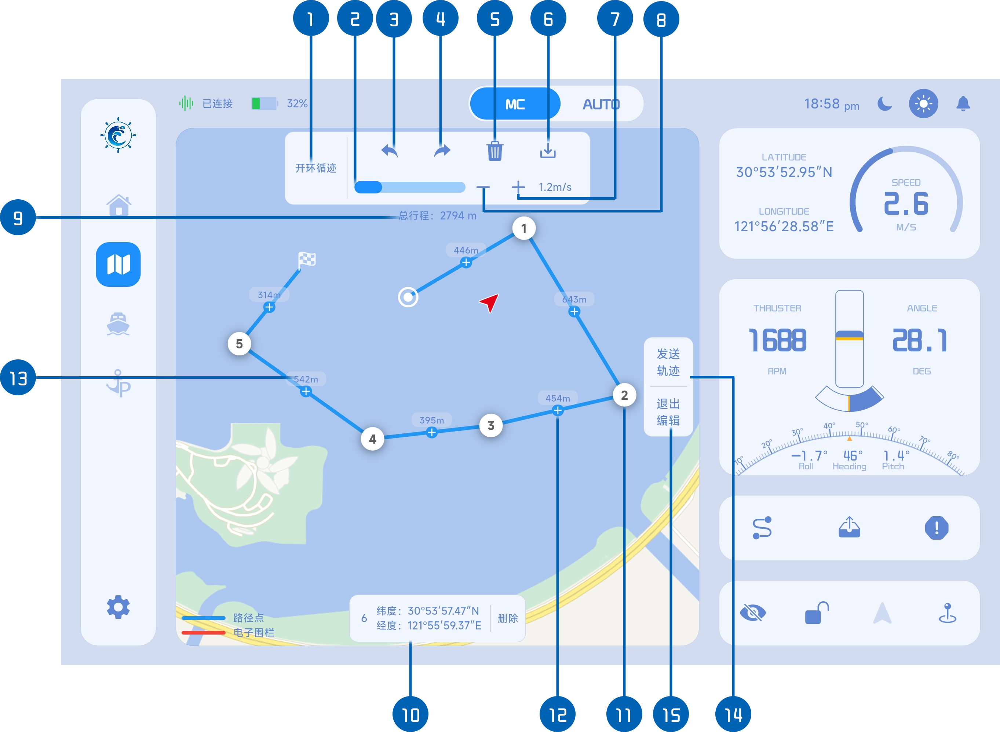
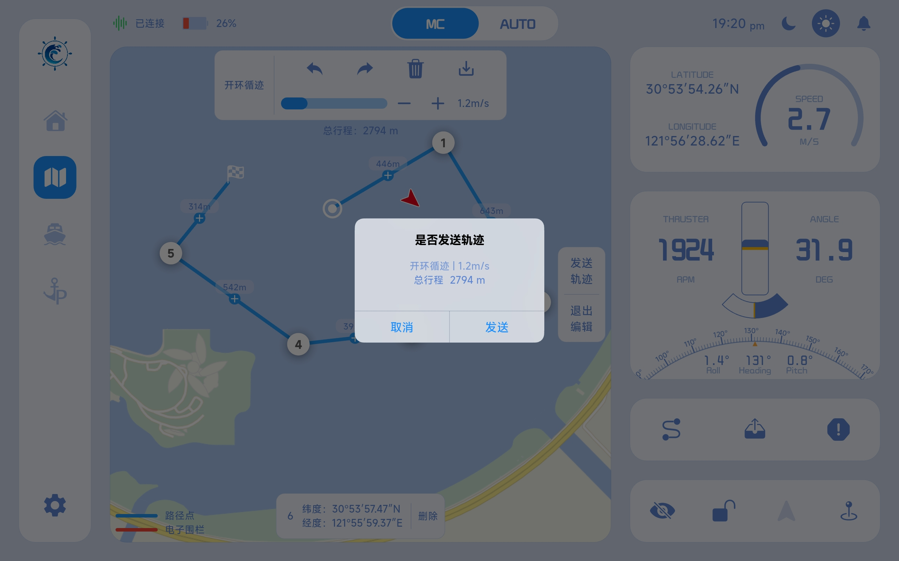

# 循迹

循迹功能用于使船舶按照预设航线自动航行。

使用该功能前，需要先配置一条航线，并设置目标航行速度。启动后，系统将控制船舶沿预设路径持续航行。

航线支持以下两种方式创建：

- 自定义绘制：在地图上手动绘制航线
- 历史加载：从已保存的航线记录中选择并加载

## 一、选择循迹类型

- 点击右下角的“循迹”按钮，进入航线模式选择弹窗

- 选择对应的航线模式后，点击“确定”，进入航线编辑状态

## 二、在地图上绘制循迹路线

### 路线绘制工具说明

在该模式下，点击地图即可添加路径点，系统会按添加顺序自动连接各点，从而生成完整航线。

1. 循迹类型：点击可重新选择循迹模式（弹出模式选择窗口）
2. 循迹速度：通过滑块设定目标航行速度
3. 撤销操作：撤销上一步编辑操作
4. 重做操作：恢复已撤销的操作
5. 清空路径点：删除当前所有路径点
6. 保存路线：将当前航线保存至本地或服务器
7. 速度微调（+）：逐步增加航行速度
8. 速度微调（-）：逐步降低航行速度
9. 总行程：自动计算当前航线总长度
10. 路径点详情：展示当前选中点信息，支持单点删除
11. 路径点：构成航线的基础节点
12. 路径中心点：点击或拖动可在中间插入新的路径点
13. 路径长度：显示相邻节点间距离
14. 发送轨迹：提交当前航线并进入发送确认流程
15. 退出编辑：退出航线绘制模式

## 三、发送循迹路线

航线绘制完成后，点击“发送轨迹”按钮，将弹出确认窗口。

用户需再次确认以下信息：

- 循迹类型
- 预设航行速度
- 总行程距离

确认无误后，点击“发送”即可下发航线任务，船舶将按照预设路线开始自动航行。

