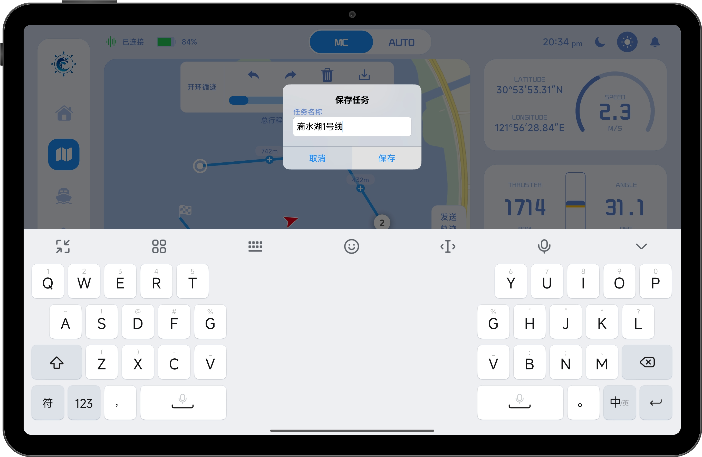
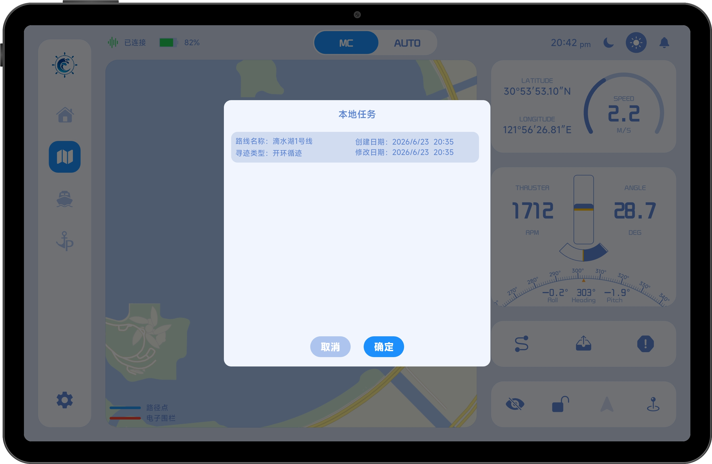

# 航线保存

App 提供航线保存功能，可将已绘制的航线（包含速度配置）保存至本地。

保存后的航线可在下次使用时直接加载，无需重新绘制，适用于高频使用的复杂航线场景，可显著提升操作效率。

## 1、保存航线

当航线绘制完成后，点击绘制工具栏右侧的“保存”按钮即可进入保存流程。

点击后将弹出保存确认窗口，用户需要为航线设置名称。系统会提供默认名称（通常为当前时间），但建议用户自定义具有识别性的名称，以便后续快速查找与管理。

确认信息无误后，点击“保存”按钮，即可将航线存储至本地。

## 2、航线加载

已保存的航线可通过本地列表快速加载。点击右下角“加载”按钮，即可打开航线列表。

在“本地任务”列表中，可以查看所有已保存的航线，例如“滴水湖1号线”。

选择目标航线后点击“确认”，系统将自动加载该航线并显示在地图中。然后可以可以按照实际需求再次编辑航线。导入后编辑过的航线不会自动保存，必须按照保存航线的方式手动保存。

## 3、说明

- 航线保存内容包含：路径点信息 + 预设速度
- 保存数据为本地持久化存储，不会因关闭 App 而丢失
- 加载航线后可直接进入编辑或发送流程
