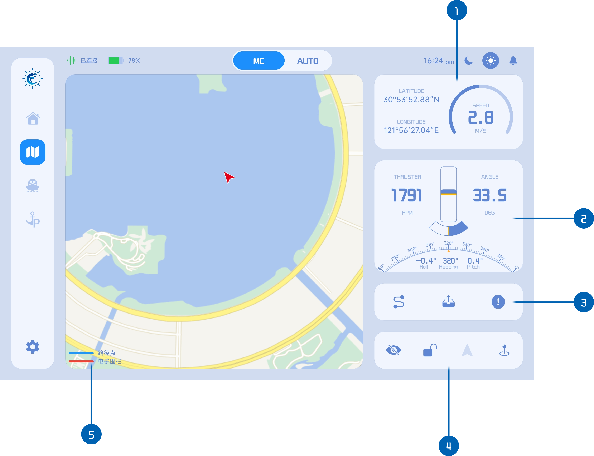

# 地图页面

1. 船舶位置经纬度和当前航速信息
2. 推进器信息和航向角信息
3. 功能按钮（循迹、保存的循迹任务、电子围栏）
4. 地图控制按钮
5. 地图图例

地图页面包含了大多数的核心功能，包括[循迹指令发送]()、[路径点编辑]()、[电子围栏绘制]()等，以及[地图控制]()功能。并且显示了船舶位置、航速、推进器等信息，是最重要的交互界面之一。

在这里可以选择不同的循迹类型，绘制好轨迹点后，发送轨迹，船舶便能按照预定轨迹行驶（避障循迹会自动监测和避开障碍物，实际轨迹可能和预设轨迹有偏差），或者设置电子围栏区域，如果船舶驶出围栏区域，平板将发出警告提示。您还可以把常用的[航线保存]()到平板，下次使用时即可选择保存的航线直接开始循迹，不用重新绘制。