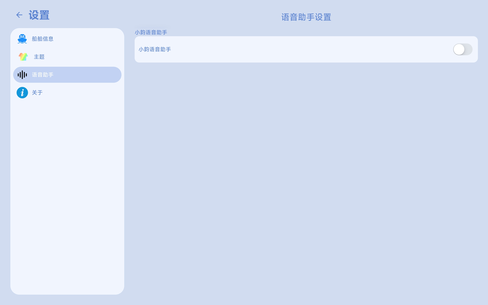
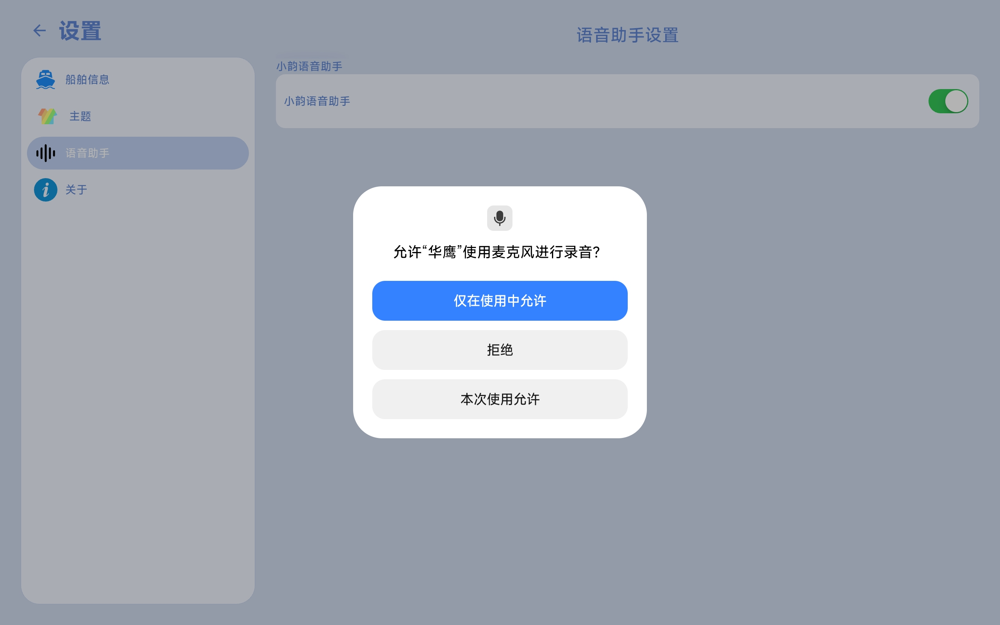
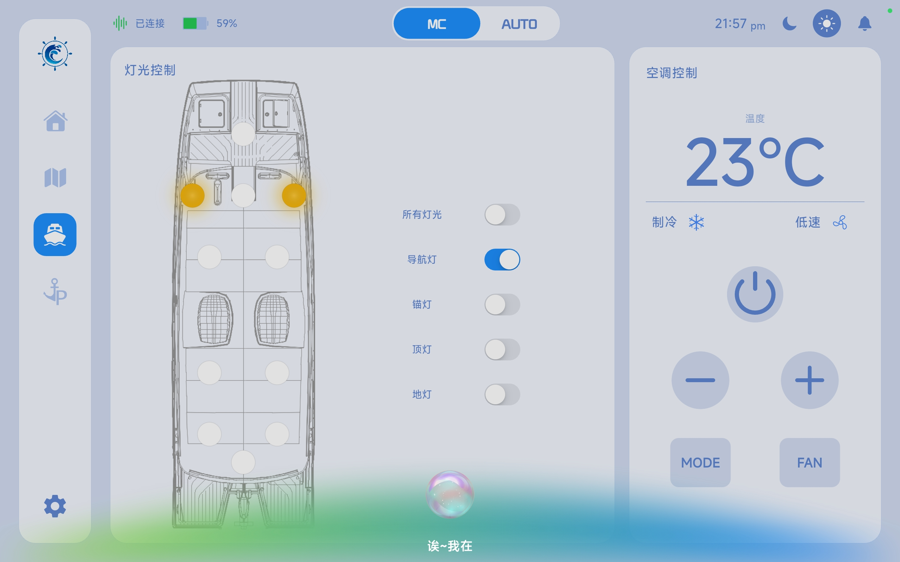

# 语音助手

App 提供语音助手功能开关，用于通过语音方式控制船舶智能设备，提升操作便捷性与交互效率。

## 一、语音助手开关

用户可在设置页面开启或关闭语音助手功能。

## 二、权限授权

首次开启语音助手时，系统需要申请麦克风权限。

用户需授权麦克风访问权限，以便语音助手（“小韵”）能够接收语音指令。

## 三、语音唤醒与控制

完成授权后，用户可通过语音唤醒语音助手。

在平板端说出：

> “你好小韵”

即可唤醒语音助手“小韵”，并通过语音指令控制船舶相关智能设备。

用户可在[语音助手](../../XiaoYun/xiaoYun.md)说明页面查看更多功能详情。

## 四、说明

- 语音功能依赖麦克风权限，请确保已正确授权
- 语音唤醒词为“你好小韵”
- 语音助手可用于控制灯光、空调等船载设备
- 功能可在设置中随时开启或关闭
