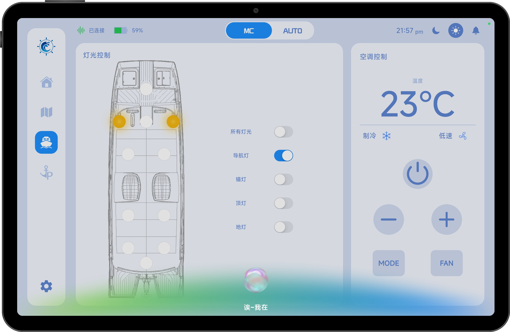

# 小韵语音助手

小韵语音助手是一种面向船舶智能设备的语音交互功能，用户无需手动操作平板，即可通过语音指令完成设备控制，实现更高效、便捷的操作体验。

在设置页面[打开语音助手](../SettingPage/feature/languageAssistant.md)功能后，用户可通过唤醒词：

> “你好小韵”

唤醒成功后，页面将显示语音助手悬浮窗口，并自动进入语音监听状态，等待用户发出指令。

当底部的小球开始旋转时，表示小韵正在监听用户语音。

若唤醒后长时间未检测到有效语音指令，小韵将自动退出监听状态，小球停止旋转。此时用户可通过以下方式重新进入监听状态：

- 再次说出唤醒词“你好，小韵”
- 点击悬浮窗口中的静止小球

## 1、核心能力

小韵语音助手支持对船舶智能设备的多维度控制，主要包括以下能力：

- 灯光系统控制（整体或单设备开关）
- 空调系统控制（开关、模式、温度、风速等）
- 船舶自动/手动模式切换

用户只需通过自然语言发出指令，即可快速完成设备操作，无需进入对应控制页面。

## 2、支持的语音指令范围

小韵语音助手支持多种自然语言表达方式，系统会自动识别用户意图并映射到对应控制行为。

### 2.1 灯光控制

支持对全船灯光或单个灯具进行控制，包括但不限于：

- 顶灯
- 地灯
- 导航灯
- 锚灯

支持的操作包括：

- 开启指定灯光
- 关闭指定灯光
- 全部灯光开启
- 全部灯光关闭

示例指令：

- 打开顶灯
- 关闭导航灯
- 打开所有灯光
- 关闭全部灯光

------

### 2.2 空调控制

支持对空调系统进行完整控制，包括：

- 开启/关闭空调
- 温度调节
- 运行模式切换
- 风速调节

支持的运行模式：

- 制冷模式
- 制热模式
- 除湿模式

支持的风速档位：

- 低速
- 中速
- 高速
- 自动

同时支持模糊语义识别，例如：

- 温度调高一点
- 温度降低一些
- 风速调小一点
- 风速调高一些

系统将根据当前状态自动执行对应调整。

------

### 2.3 自动/手动模式切换

支持通过语音切换船舶运行模式，包括：

- 自动模式
- 手动模式

支持多种自然语言表达方式，例如：

- 开启自动驾驶
- 切换到自动模式
- 关闭自动驾驶
- 切换到手动模式

系统识别后将自动执行对应模式切换。

## 3、说明

- 使用语音功能前需确保已开启语音助手并授予麦克风权限
- 第一次打开语音助手需要连接网络
- 唤醒词为“你好小韵”
- 语音指令会实时映射到对应设备控制逻辑
- 为获得更好的识别效果，建议在相对安静的环境中使用语音助手功能。